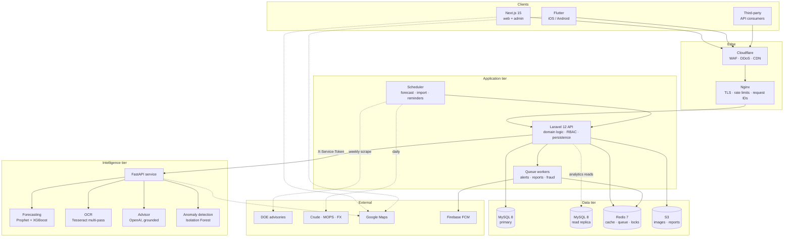
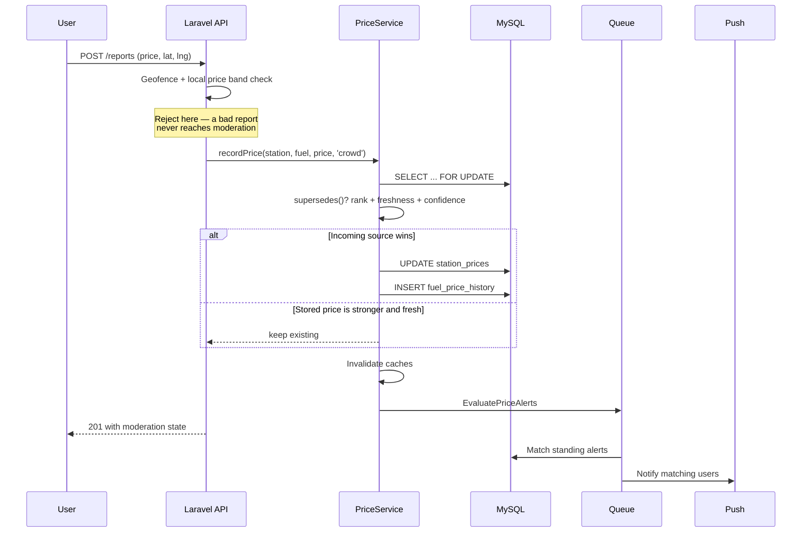
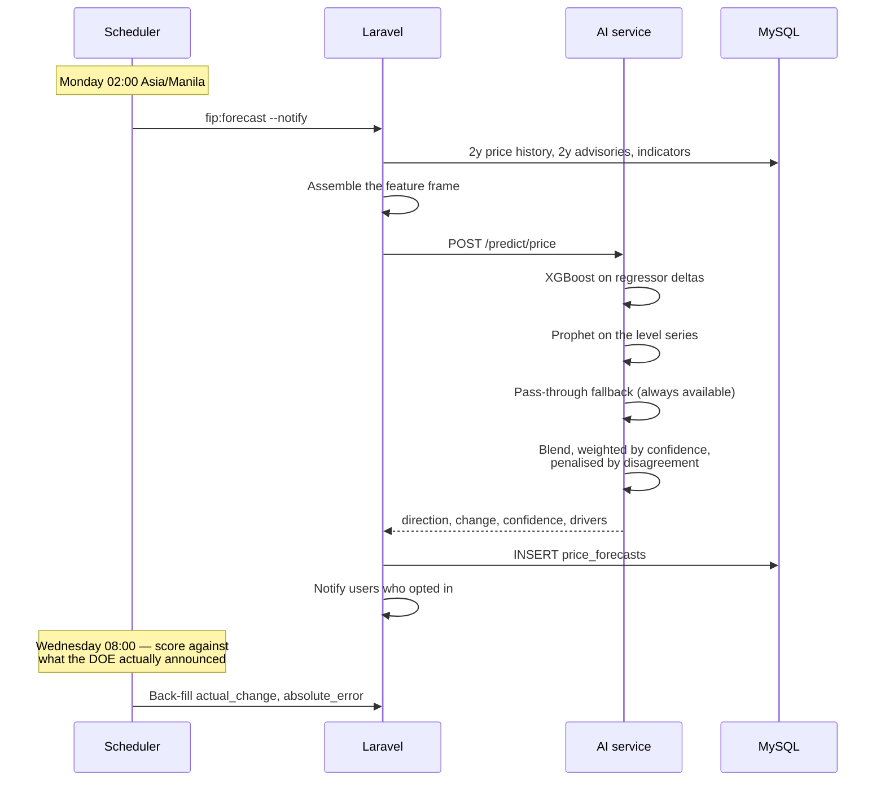

# 1. System Architecture

## 1.1 What the system is

FIP turns four unreliable, disconnected sources of Philippine fuel price data
into one dependable stream, and then makes decisions on top of it.

The four sources, in descending order of trustworthiness:

| Source | Latency | Coverage | Trust |
|--------|---------|----------|-------|
| Station operator feed | minutes | only participating brands | authoritative |
| DOE weekly advisory | weekly | nationwide, but a *delta* not a price | authoritative |
| OCR price-board scan | minutes | wherever a user stands | high, machine-verified |
| Crowd report | seconds | wherever a user stands | variable, needs moderation |

None is sufficient alone. The DOE publishes an adjustment, not a price, so it
cannot tell you what a specific station charges. Operators cover their own
network only. Crowd reports are fast and broad but occasionally wrong or
malicious. The platform's central job is to merge them with an explicit
precedence rule and never let a weak source silently overwrite a strong one.

That rule lives in exactly one place — `PriceService::recordPrice()` — and
every write path funnels through it.

---

## 1.2 Component view



### Why the AI tier is a separate service

It would be simpler to run the models inside Laravel. Three things make the
separation worth its cost:

1. **Language fit.** Prophet, XGBoost and scikit-learn have no serious PHP
   equivalent. Reimplementing them would be worse than calling them.
2. **Failure isolation.** A model that hangs on a pathological input must not
   exhaust the PHP-FPM pool and take the whole API down with it. The client
   enforces a hard timeout and a bounded retry; a dead AI service degrades
   forecasting, not sign-in.
3. **Independent scaling.** OCR is CPU-bound and bursty; the API is I/O-bound
   and steady. Scaling them together wastes money on whichever is idle.

The cost is a network hop and a serialisation boundary. That is paid for by
keeping the *feature assembly* in Laravel — the AI service receives a prepared
frame and returns a prediction, so there is exactly one definition of what the
model sees and any historical forecast can be replayed.

---

## 1.3 Request flows

### Recording a price (the critical path)



The `SELECT ... FOR UPDATE` matters: two users at the same station reporting
simultaneously would otherwise both read the old price and both write, losing
one update and corrupting `previous_price`.

### Weekly forecast



Scoring is not optional. A forecast product that never publishes its error
rate is asking users to trust an unfalsifiable claim.

---

## 1.4 Layering inside the API

```
app/
├── Domain/<Context>/
│   ├── Models/          Eloquent entities + invariants that belong to the row
│   ├── Repositories/    All query construction; nothing else builds queries
│   └── Services/        Business rules, transactions, orchestration
├── Http/
│   ├── Controllers/     HTTP shape only — parse, authorise, delegate, present
│   ├── Requests/        Validation, including cross-field rules
│   ├── Resources/       Response shaping
│   └── Middleware/
├── Jobs/                Anything that must not block a response
├── Policies/            Authorisation decisions
├── Services/External/   Typed clients for the AI service and FCM
└── Support/             Base repository, concerns, exceptions, response envelope
```

The rule that keeps this honest: **a controller may not contain an `if` about
business state.** If it does, that logic belongs in a service where it can be
unit-tested without an HTTP request. Controllers parse, authorise, delegate and
present — nothing else.

### Why the repository pattern here

Not for database portability — this system will run on MySQL. It earns its
place for two other reasons:

- **Query construction is centralised.** `BaseRepository` allow-lists which
  columns may be filtered or sorted, so a user-supplied `?sort=` can never
  reach the query builder unless a developer opted it in. That closes a whole
  class of injection and mass-filtering bugs by construction.
- **Services stay testable.** `FuelExpenseService` can be unit-tested against
  a mocked repository without a database, which is why its arithmetic has
  precise test coverage.

---

## 1.5 Data tier decisions

### Spatial search

Stations are queried by proximity constantly. `gas_stations` carries a
generated `POINT` column with a `SPATIAL` index, but the query does **not** go
straight to `ST_Distance_Sphere`:

```sql
WHERE latitude BETWEEN ? AND ?        -- prune with the B-tree first
  AND longitude BETWEEN ? AND ?
HAVING ST_Distance_Sphere(...) <= ?   -- then compute exactly
```

The bounding box is cheap and eliminates almost everything; the exact spherical
distance then runs over a handful of rows instead of the whole table.

### Partitioned history

`fuel_price_history` is append-only and grows without bound — every price
change at every station, forever. It is range-partitioned by month, so a query
for "the last 90 days" touches three partitions rather than years of data, and
old partitions can be dropped in constant time.

### Read replica

Analytics queries (`heatMap`, `nationalTrend`, `regionalMovement`) scan large
ranges and would otherwise compete with the transactional workload. The `mysql`
connection therefore declares Laravel's native read/write split: every `SELECT`
goes to `DB_READ_HOST`, and writes go to `DB_HOST`.

`sticky` is enabled, so a connection that has already written in the current
request reads from the primary for the rest of it — a request that records a
fill-up never then reads back a replica copy that predates it. A stale read is
unacceptable on the price write path but irrelevant for a six-month trend chart,
and stickiness draws exactly that line.

`DB_READ_HOST` is optional: leave it unset for a single-node database and reads
fall back to `DB_HOST`.

### Cache invalidation

Redis caches the most-hit reads (comparison matrix, trend series, heat map).
Invalidation is explicit and narrow — `PriceService::flushCaches()` clears the
specific keys a price change affects, rather than flushing everything. A
station in Cebu changing its diesel price should not evict the Metro Manila
gasoline trend.

---

## 1.6 Failure behaviour

The system is designed to degrade rather than fail. Each dependency has a
defined fallback:

| Dependency down | What breaks | What still works |
|-----------------|-------------|------------------|
| AI service | new forecasts, OCR, chat, route optimisation | everything else; stored forecasts still display |
| OpenAI key absent | conversational nuance | advisor answers deterministically from context, labelled `grounded: false` |
| Trained model artefact absent | boosted accuracy | transparent pass-through forecast, weights published in the response |
| Google Maps key absent | map rendering, live traffic | price lists, geometric route estimates |
| Redis | caching, queues | reads (slower, direct from MySQL) |
| FCM | push delivery | in-app notification centre still records everything |
| Read replica | — | queries fall back to the primary |

Two of these deserve emphasis because they are where systems usually cheat:

- **The forecast fallback does not fabricate.** With fewer than 14 days of
  history it returns `model_used: "insufficient-data"` and a confidence of
  0.25, rather than emitting a plausible-looking number.
- **The advisor fallback tells the truth about itself.** `grounded: false`
  travels to the client so the UI can label the answer, instead of passing off
  a template as a model response.

---

## 1.7 Security architecture

Defence is layered so that no single failure is fatal:

| Layer | Control |
|-------|---------|
| Cloudflare | WAF, DDoS absorption, bot filtering |
| Nginx | TLS 1.2/1.3, HSTS, per-endpoint rate limits, request IDs |
| Laravel middleware | JSON forcing, security headers, tenant scoping, telemetry |
| Application | JWT with short TTL, TOTP MFA, RBAC, per-record policies |
| Domain | Allow-listed filters, geofence and price-band gates, audit trail |
| Data | Encrypted MFA secrets, hashed recovery codes, soft deletes, immutable audit log |

The audit log is genuinely immutable: `AuditLog` throws on `updating` and
`deleting`, so a compromised application cannot rewrite its own history.

Full detail in [07-security.md](07-security.md).

---

## 1.8 Scaling path

The stack scales in the order the load actually arrives:

1. **Now (single host).** Everything in Docker Compose on one Ubuntu machine.
   Comfortable to roughly 10k daily active users.
2. **First pressure point: reads.** Add the MySQL read replica and point
   analytics at it. Already implemented — only the host needs configuring.
3. **Second: API concurrency.** `api` and `web` are stateless; raise the
   replica count behind Nginx. Sessions live in JWTs, not server memory, so
   no sticky routing is needed.
4. **Third: AI throughput.** OCR is the CPU hog. Scale `ai-service` replicas
   independently; each holds its own model artefacts in memory.
5. **Fourth: write volume.** `fuel_price_history` partitions roll monthly.
   Beyond that, move history to a column store and keep MySQL for the live
   `station_prices` row per station.

The scheduler is the one component pinned to a single replica — two schedulers
would double-fire every cron job, applying the weekly DOE adjustment twice.
