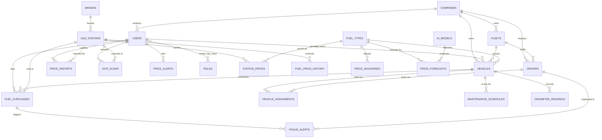

# 3. Entity Relationship Diagram

Source: [`database/erd.mmd`](../database/erd.mmd). Render at
[mermaid.live](https://mermaid.live) or with
`mmdc -i database/erd.mmd -o erd.svg`.

---

## 3.1 Core domain

The relationships that carry the product's logic. Reference tables and pivots
are omitted here for legibility — the full diagram is in the source file.

---

## 3.2 Relationships worth explaining

### A vehicle has two possible owners

`vehicles.owner_id` (a private motorist) and `vehicles.company_id` (a business)
are both nullable. This is not sloppiness — the two cases behave differently
throughout:

- A private vehicle is visible to its owner and nobody else.
- A company vehicle is visible to that company's staff, scoped by role, and its
  fuel data rolls into fleet analytics.

`HasCompanyScope::forUser()` branches on exactly this, and `VehiclePolicy`
encodes the different deletion rights.

### Driver assignment is temporal, not a foreign key

A naive design puts `driver_id` on `vehicles`. That loses history: when a fuel
anomaly surfaces three weeks later, you need to know who held the vehicle *at
the time of the transaction*, not who holds it now.

`vehicle_assignments` records `assigned_at` and `released_at`, so the question
"who was driving NS 1001 on 23 July?" has an answer. `FleetController::assign()`
releases any live assignment on both sides before creating the new one, keeping
the invariant that a vehicle and a driver each hold at most one open row.

### A driver may or may not be a user

`drivers.user_id` is nullable. Many fleet drivers never install the app — a
dispatcher logs their fill-ups. They still need a record for assignment,
licence expiry tracking and efficiency scoring. Making the app account
mandatory would force fake user rows.

### Price reports and station prices are separate tables

A crowd report is a *claim*; `station_prices` holds the *accepted* price. They
are separate because a report has its own lifecycle — pending, corroborated,
approved, rejected — and its own audit value. Merging them would either lose
the moderation trail or pollute the live table with unverified rows.

### Forecasts store both prediction and outcome

`price_forecasts` carries `change_amount` (predicted) alongside
`actual_change` and `absolute_error` (back-filled after the DOE announces).
One row is the complete record of a claim and its verification, which is what
makes `/forecasts/accuracy` computable rather than asserted.

---

## 3.3 Cardinality summary

| Relationship | Cardinality | Delete behaviour |
|--------------|-------------|------------------|
| Company → Users | 1:N | `SET NULL` (the person outlives the employment) |
| Company → Vehicles | 1:N | `CASCADE` |
| User → Vehicles | 1:N | `CASCADE` |
| Vehicle ↔ Driver | M:N over time | `CASCADE` on the assignment row |
| Vehicle → Fuel purchases | 1:N | `CASCADE` |
| Station → Prices | 1:N | `CASCADE` |
| Station → History | 1:N | no FK (partitioned, append-only) |
| Fuel type → Prices | 1:N | `RESTRICT` — a fuel type in use cannot be deleted |
| Station ↔ Amenities | M:N | `CASCADE` both sides |
| User → Price reports | 1:N | `CASCADE` |
| Model → Forecasts | 1:N | `SET NULL` (the forecast outlives its model version) |

The `SET NULL` cases are deliberate: deleting a model version must not erase
the forecasts it produced, because those forecasts are the accuracy record.
